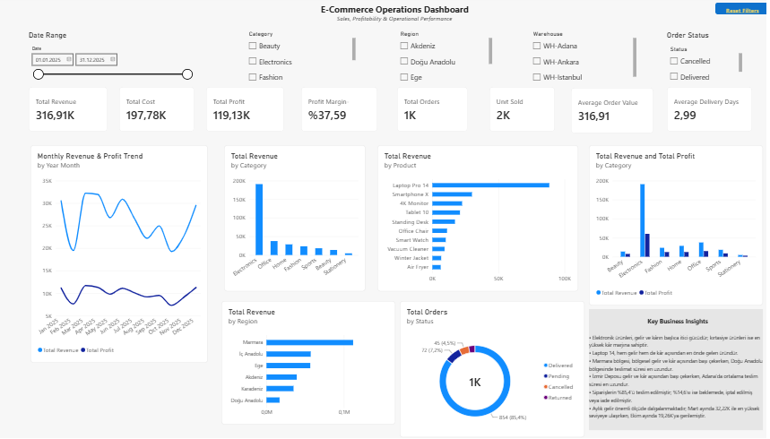

# ecommerce-operations-dashboard
Interactive Power BI dashboard for analyzing e-commerce sales, profitability and operational performance.
# E-Commerce Operations Dashboard

## Project Overview

An interactive Power BI dashboard developed to analyze e-commerce sales, profitability, product performance and operational efficiency.

The project uses 1,000 synthetic e-commerce order records and demonstrates an end-to-end business intelligence workflow from data preparation to business insights.

## Objectives

- Monitor sales and profitability performance
- Analyze product and category performance
- Identify regional performance differences
- Evaluate warehouse and delivery performance
- Analyze order status and operational performance
- Translate data findings into actionable business insights

## Tools & Technologies

- Microsoft Power BI
- Power Query
- DAX
- Microsoft Excel

## Key KPIs

- Total Revenue
- Total Cost
- Total Profit
- Profit Margin
- Total Orders
- Units Sold
- Average Order Value
- Average Delivery Days

## Analysis

The dashboard includes:

- Product Analysis
- Category Analysis
- Region Analysis
- Time Analysis
- Operations Analysis
- Cross Analysis
- Business Insights

## Dashboard



## Business Insights

Key findings from the analysis include:

- Electronics is the primary revenue and profit driver, while Stationery has the highest profit margin.
- Laptop 14 is the leading product in both revenue and profit.
- Marmara leads regional revenue and profit, while Doğu Anadolu has the longest delivery time.
- İzmir Warehouse leads revenue and profit, whereas Adana has the highest average delivery time.
- 85.4% of orders are delivered, while 14.6% are pending, cancelled or returned.
- Monthly revenue varies significantly throughout the year.

## Project Structure

```text
dashboard/
    E-Commerce Operations Dashboard.pbix

screenshots/
    executive-overview.png
    business-insights.png
    operations-analysis.png

data/
    ecommerce_orders.xlsx
